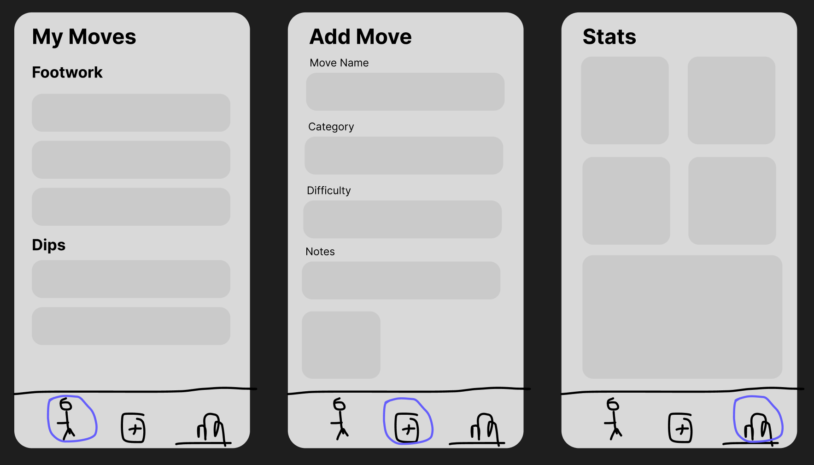

# Swing Journal

A personal dance move journal for swing dancers. Log moves you've learned, categorize them, record short video clips, and rate difficulty. The goal is to be able to keep track of all the moves you've learned so you don't forget them!

## Expo Packages

- expo-image-picker
- expo-video
- expo-haptics
- expo-crypto
- expo-sensors
- expo-gl
- expo-three

## HIG & Material Design

- Lists: Following https://m3.material.io/components/lists/specs and https://developer.apple.com/design/human-interface-guidelines/lists-and-tables, On the Moves page (far left tab), I designed list items that followed the general leading slot, content slot, and trailing slot format. I made sure not to have multiple selection styles, and used label text above with supporting text below. I also keep the margin measurements correct. I also used the right arrow icon from IOS.
- Dark Mode: My app is in a natural dark mode, so I followed https://developer.apple.com/design/human-interface-guidelines/dark-mode to design the right colors. I chose an electric blue as the highlight color, which pair well with the dark grey background. I also found out you have to specifically set the status bar to "light" if you want to be able to see the time and battery etc. 
- Tabs: Used https://developer.apple.com/design/human-interface-guidelines/tab-bars to design the tabs. Originally I was going to only include the icon, but everything I found included the tab names as well. Also, I tried to do a similar style, but without the liquid glass. 

## Design & Prototypes

## Process

- I first built the basic app with general functionality. I was able to get the video importing and taking working. Next I'm working on some more design and some more video clipping. 
- Got the videoclipping working. I was able to make it so you can clip the video before uploading it. Very convenient. Next I will work on the hand movements with the phone in hand.
- I have been working on the motion tracking. I got it to track something and put it kinda on the screen. Now I just need to fine tune it
- I got it to show the general pattern a lot better and it seems to be working in general. The movements are still a bit off and jagged, but I think I can smooth it out and make the visual work a lot better